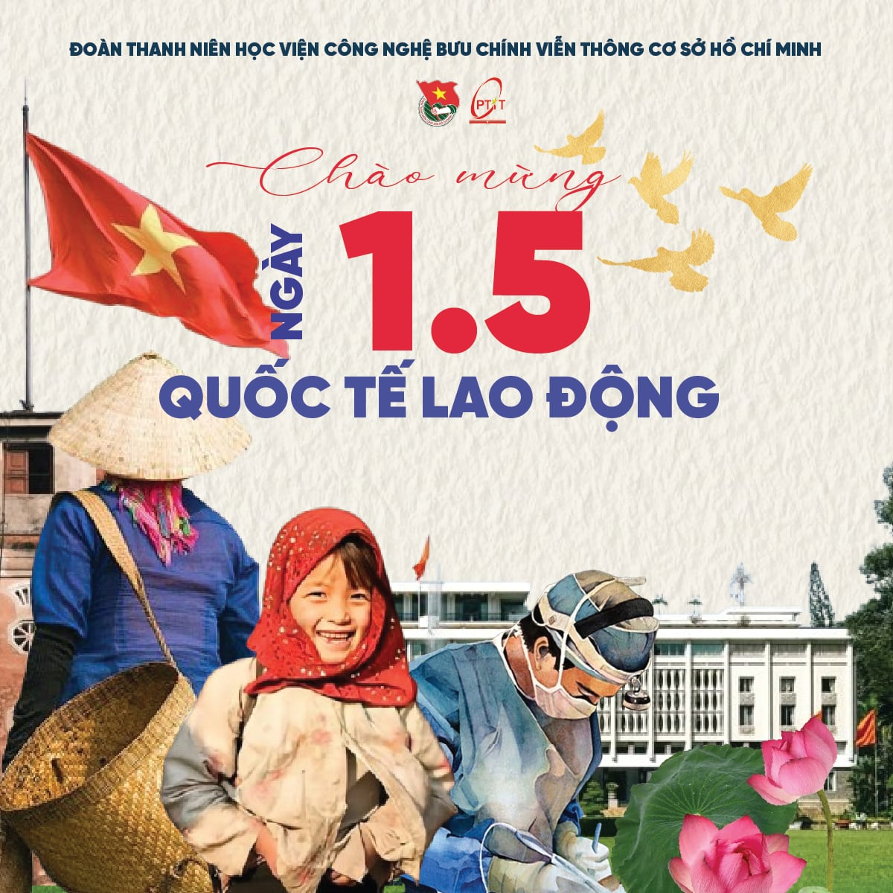

  

  <a href="https://git.io/typing-svg">

  

    <b>Sinh viên năm 3 | Ngành Công nghệ Đa phương tiện</b> 
    Học viện Công nghệ Bưu chính Viễn thông – Cơ sở tại TP.HCM (PTIT-HCM)
  

---

### ⏰ Mục lục
- [Giới thiệu nhanh](#-giới-thiệu-nhanh)
- [Contact me](#-contact-me)
- [Trình độ học vấn](#-trình-độ-học-vấn)
- [Kỹ năng](#-kỹ-năng)
- [Kinh nghiệm](#-kinh-nghiệm)
- [Mục tiêu nghề nghiệp](#-mục-tiêu-nghề-nghiệp)

---

### 👋 Giới thiệu nhanh
- Yêu thích thiết kế, thích sáng tạo và tìm hiểu những kiến thức về thiết kế đồ họa.
- Mong muốn được học hỏi và phát triển kỹ năng trong môi trường chuyên nghiệp.
- Mục tiêu: Trở thành một Branding Designer chuyên nghiệp.

---

### 💕 Contact me

  
  
  

---

### 🎓 Trình độ học vấn
- **Ngành học**: Công nghệ Đa phương tiện
- **Lớp**: D23CQPTTK01-N
- **Mã số sinh viên**: N23DCPT077
- **Trường**: Học viện Công nghệ Bưu chính Viễn thông – Cơ sở tại TP.HCM (PTIT)

---

### 🛠️ Kỹ năng

#### Kỹ năng mềm
| Kỹ năng          | Mức độ thành thạo                                 |
|-------------------|---------------------------------------------------|
| Làm việc nhóm     | <progress max="100" value="80"></progress> 80%    |
| Tư duy phản biện  | <progress max="100" value="70"></progress> 70%    |
| Sáng tạo          | <progress max="100" value="80"></progress> 80%    |
| Thuyết trình      | <progress max="100" value="60"></progress> 60%    |

 

#### Phần mềm thông thạo
<table>
  <tr>
    <td align="center" width="96">
      
       <strong>Microsoft</strong>
    </td>
    <td><progress max="100" value="80"></progress> 80%</td>
  </tr>
  <tr>
    <td align="center" width="96">
      
       <strong>Illustrator</strong>
    </td>
    <td><progress max="100" value="80"></progress> 80%</td>
  </tr>
  <tr>
    <td align="center" width="96">
      
       <strong>Photoshop</strong>
    </td>
    <td><progress max="100" value="70"></progress> 70%</td>
  </tr>
  <tr>
    <td align="center" width="96">
      
       <strong>After Effects</strong>
    </td>
    <td><progress max="100" value="60"></progress> 60%</td>
  </tr>
</table>

---

### 💼 Kinh nghiệm
- **Dự án cá nhân:**
  - Từng thực hiện một vài dự án thiết kế thời trung học.
    
    ([Poster của dự án.pdf](https://github.com/n23dcpt077-hash/PROFILE-OF-NGOCHAN/blob/ea88b41c91dc3df19daa1b272b16a3a4be29ce41/Poster%20c%E1%BB%A7a%20d%E1%BB%B1%20%C3%A1n.pdf))

     ([Dự án bán hàng MÌ ĐẬU NÀNH VÀ RAU MÁ ĐẬU XANH.pdf](https://github.com/n23dcpt077-hash/PROFILE-OF-NGOCHAN/blob/ea88b41c91dc3df19daa1b272b16a3a4be29ce41/D%E1%BB%B1%20%C3%A1n%20b%C3%A1n%20h%C3%A0ng%20M%C3%8C%20%C4%90%E1%BA%ACU%20N%C3%80NH%20V%C3%80%20RAU%20M%C3%81%20%C4%90%E1%BA%ACU%20XANH.pdf))
  - Bài tập năm nhất
    
    ([BÀI TẬP MÔN NHẬP MÔN ĐA PHƯƠNG TIỆN NĂM 1.pdf](https://github.com/n23dcpt077-hash/PROFILE-OF-NGOCHAN/blob/ea88b41c91dc3df19daa1b272b16a3a4be29ce41/B%C3%80I%20T%E1%BA%ACP%20M%C3%94N%20NH%E1%BA%ACP%20M%C3%94N%20%C4%90A%20PH%C6%AF%C6%A0NG%20TI%E1%BB%86N%20N%C4%82M%201.pdf))
- **Hoạt động ngoại khóa:**
  - Cộng tác viên Ban Truyền thông - Đoàn Thanh niên PTIT-HCM.
     
    
     
      
      
  - Cộng tác viên Ban Truyền thông - Chương trình Chào! Sinh viên 2024.

---

### 🎯 Mục tiêu nghề nghiệp
- **Ngắn hạn**:
  - Tích lũy kiến thức nền tảng vững chắc về thiết kế thương hiệu, marketing và truyền thông.
  - Tham gia các dự án thực tế để trau dồi kinh nghiệm và xây dựng portfolio.
- **Dài hạn**:
  - Trở thành một Branding Designer có chuyên môn cao, có khả năng xây dựng và phát triển hình ảnh thương hiệu một cách nhất quán và hiệu quả.

---
  
 

  

  💙 Cảm ơn bạn đã xem hồ sơ của mình! 💙

